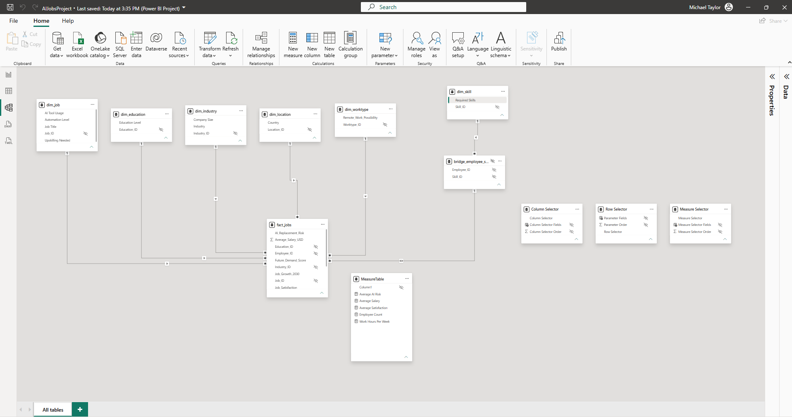

# AI Jobs Analytics Project

## Report Preview


## Semantic Model



## Overview

This project demonstrates a modern analytics engineering and Power BI development workflow using Python, Parquet, GitHub, and Power BI Project files (PBIP).

The purpose of this project is to transform a raw CSV dataset into a curated star schema model optimized for Power BI reporting, semantic modeling, and enterprise BI development practices.

---

# Architecture

```text
Raw CSV
    ↓
Python Ingestion Script
    ↓
Parquet Storage
    ↓
Notebook Transformations
    ↓
Star Schema Modeling
    ↓
Power BI Semantic Model
    ↓
GitHub Version Control
```

---

# Project Structure

```text
pbi-ai-jobs-project
│
├── data
│   ├── AI_Impact_on_Jobs_2030.csv
│   ├── jobs_raw.parquet
│   └── processed
│       ├── fact_jobs.parquet
│       ├── dim_job.parquet
│       ├── dim_location.parquet
│       ├── dim_industry.parquet
│       ├── dim_education.parquet
│       ├── dim_worktype.parquet
│       ├── dim_skill.parquet
│       └── bridge_employee_skill.parquet
│
├── notebooks
│   └── transform.ipynb
│
├── scripts
│   └── ingest_data.py
│
├── sql
│
├── docs
│
├── powerbi
│   ├── AIJobsProject.pbip
│   ├── AIJobsProject.Report
│   └── AIJobsProject.SemanticModel
│
├── requirements.txt
├── .gitignore
└── README.md
```

---

# Technologies Used

- Power BI Desktop
- Power BI Project Files (PBIP)
- Python
- Pandas
- Jupyter Notebooks
- Parquet
- VS Code
- Git
- GitHub

---

# Development Workflow

## 1. Create Repository

Create a GitHub repository and clone it locally into VS Code.

```bash
git clone <repo-url>
```

---

## 2. Create Virtual Environment

```bash
python -m venv .venv
```

Activate the environment.

### Windows PowerShell

```powershell
.venv\Scripts\Activate.ps1
```

---

## 3. Install Dependencies

```bash
pip install pandas pyarrow jupyter notebook
```

Export dependencies.

```bash
pip freeze > requirements.txt
```

---

# Data Ingestion

The ingestion script converts the raw CSV file into parquet format.

## Run Ingestion Script

```bash
python scripts/ingest_data.py
```

## Output

```text
/data/jobs_raw.parquet
```

---

# Data Transformation

Transformations are performed inside:

```text
/notebooks/transform.ipynb
```

The notebook handles:

- Data cleaning
- Surrogate key generation
- Dimension table creation
- Fact table creation
- Bridge table creation
- Star schema modeling
- Parquet output generation

---

# Star Schema Design

## Fact Table

### fact_jobs

Contains measurable business metrics including:

- Average Salary
- AI Replacement Risk
- Future Demand Score
- Job Satisfaction
- Performance Score
- Work Hours
- Years of Experience

---

## Dimension Tables

### dim_job

Contains:

- Job Title
- Automation Level
- AI Tool Usage
- Upskilling Needed

### dim_location

Contains:

- Country

### dim_industry

Contains:

- Industry
- Company Size

### dim_education

Contains:

- Education Level

### dim_worktype

Contains:

- Remote Work Possibility

### dim_skill

Contains:

- Individual skills extracted from the multi-value skill column

---

## Bridge Table

### bridge_employee_skill

Handles the many-to-many relationship between:

- Employees
- Skills

---

# Power BI Workflow

## Load Processed Tables

In Power BI:

```text
Get Data → Parquet
```

Load:

- fact_jobs
- dimension tables
- bridge table

---

# Relationship Design

Relationships are created manually using a star schema structure.

## Standard Relationships

```text
Dimension Table (1)
        ↓
Fact Table (*)
```

Cross-filter direction:

- Single

---

# Measure Organization

A dedicated measure table is used to organize DAX measures.

## Example Measures

```DAX
Average Salary =
AVERAGE(fact_jobs[Average_Salary_USD])
```

```DAX
Employee Count =
COUNT(fact_jobs[Employee_ID])
```

```DAX
Average AI Risk =
AVERAGE(fact_jobs[AI_Replacement_Risk])
```

---

# Power BI Project Format

The project uses:

```text
.pbip
```

instead of:

```text
.pbix
```

## Benefits

- Git-friendly
- Source control support
- Text-based project structure
- Easier collaboration
- Better enterprise workflow alignment

---

# Git Workflow

## Stage Changes

```bash
git add .
```

## Commit Changes

```bash
git commit -m "Add semantic model updates"
```

## Push Changes

```bash
git push
```

---

# Recommended Future Enhancements

- Tabular Editor integration
- Microsoft Fabric Lakehouse
- Azure Data Factory pipelines
- Databricks notebook workflows
- CI/CD deployment pipelines
- Semantic model automation
- Automated refresh orchestration

---

# Learning Objectives

This project demonstrates practical experience with:

- Dimensional modeling
- Star schema design
- Semantic modeling
- Power BI development
- Analytics engineering workflows
- Python-based ETL
- Parquet storage
- Git version control
- PBIP project structure
- Enterprise BI development practices

---

# Notes

This repository is intended as a learning and portfolio project focused on modern Microsoft BI and analytics engineering workflows.